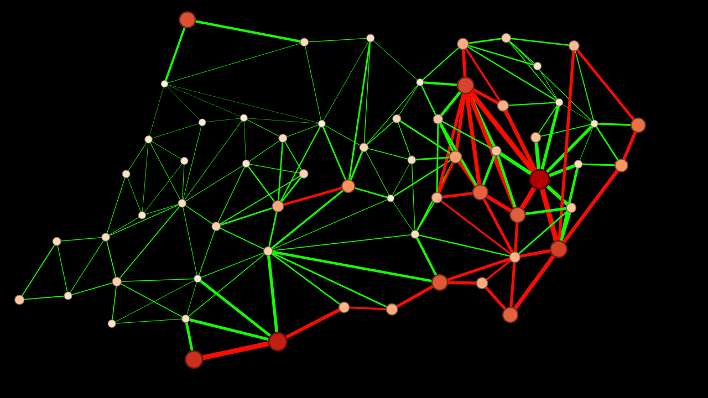
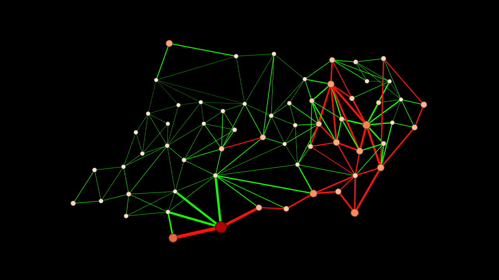
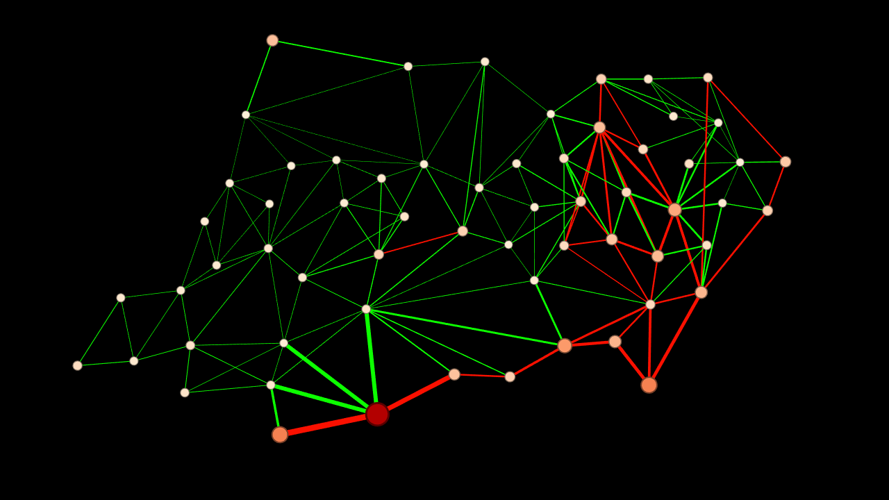

# Desmatamento No Amazonas
O trabalho desenvolvido propõe delimitar uma área de desmtamento acima da média no estado do Amazonas. Essa proposta abre espaço para estudo de significancia da correlação entre atividades socioeconomicas comuns nas regiões onde o desflorestamento raso mais ocorre no Amazonas. Afinal apesar da amostra analisada ser ter dados de 2000 até 2018, há diversas variáveis como a delimitação de Zonas Ecológicas Econômicas que se estendem no estado até o ano de 2023.

## Artigo Amador:
-[Primeira versão](Readme/PDF/Delimitação_de_Desmatamento_Acima_da_Média_no_Amazonas_Com_Cliques_em_Grafos.pdf)

## Algumas Vizualizações Obtidas com Gephi:
  
[Desmatamento no ano de 2000](Readme/img/AmazonasG's/2000Graph.png)

  
[Desmatamento no ano de 2008](Readme/img/AmazonasG's/2008Graph.png)

  
[Desmatamento no ano de 2018](Readme/img/AmazonasG's/2018Graph.png)

<!-- 
# Introdução
# Metodologia
    # OSEMN
    #
-->

# Metodologia
## Ciclo de Vida 
O projeto seguirá o ciclo de vida [OSEMN(Obtain Scrub Explore Model iNterpret)](#https://web.archive.org/web/20160220042455/http://www.dataists.com/2010/09/a-taxonomy-of-data-science/) como guia de metodologia ágil proposto pela cientista de dados [Hilary Mason](#https://web.archive.org/web/20160220042455/http://www.dataists.com/2010/09/a-taxonomy-of-data-science/).

## Referências

[1] PAZ, Kizzy F. T. F. Ciência de Dados Aplicada. Disponível em: <https://github.com/kterra/ciencia-de-dados-aplicada>. Acesso em: 9 nov. 2023.

[2] PRODES — Coordenação-Geral de Observação da Terra. Disponível em: <http://www.obt.inpe.br/OBT/assuntos/programas/amazonia/prodes>. Acesso em: 9 nov. 2023.

[3] MASON, H. A Taxonomy of Data Science. dataists, set. 25DC. Disponível em: <https://web.archive.org/web/20160220042455/http://www.dataists.com/2010/09/a-taxonomy-of-data-science/>. Acesso em: 9 nov. 2023.

‌[4] IBGE. Mapa Escolar do Estado do Amazonas, 2 jun. 2016.
Disponível em: <https://geoftp.ibge.gov.br/produtos_educacionais/mapas_tematicos/mapas_do_brasil/mapas_estaduais/politico/amazonas.jpg>. Acesso em: 14 nov 2023.

‌
‌[5] KRATOCHVÍL, J.; NEŠETŘIL, J. INDEPENDENT SET and CLIQUE problems in intersection-defined classes of graphs. v. Vol. 31, p. 85--93, 1990. Disponível em: <https://dml.cz/bitstream/handle/10338.dmlcz/106821/CommentatMathUnivCarol_031-1990-1_11.pdf>. Acesso em: 20 nov 2023.

‌

‌
<!-- IDEIAS -->
 
 <!-- 1. Existe uma correlação entre conectividade e Desmatamento?

        1. Atribui-se peso aos cliques buscando os números de desmatamento total em cada clique

        2. Atribui-se 
 -->
 
 <!-- 2. Correlação Local?

        Considere a correlação local, onde você examina a correlação entre o desmatamento de um município e o desmatamento de seus vizinhos diretamente conectados. Isso pode revelar padrões locais na relação entre conectividade e desmatamento.
 -->

 <!-- 3. Identificação de Cliques?

        Observando cliques verifique se eles possuem características semelhantes sobre desmatamento ou sobre urbanização, ou sobre demais métricas.

 -->

  <!-- 4. Análise de Fluxo nos algoritmos?
        Explore algoritmos de fluxo em grafos para entender como a conectividade impacta a disseminação do desmatamento através da rede viária. Considere algoritmos de caminho mínimo ponderado para modelar o impacto ambiental da conectividade.
 -->

<!-- 5. Centralidade dos vértices
        Calcule métricas de centralidade dos vértices, como a centralidade de grau, centralidade de proximidade ou centralidade de intermediação, para identificar os municípios mais centrais em termos de conectividade. Analise se esses municípios centrais têm padrões distintos de desmatamento.

 -->

<!-- PERSISTENTES -->

<!-- Análise de Centralidade 
    Centralidade de Proximidade (Closeness Centrality):
    Centralidade Harmonic (Harmonic Centrality):
    Centralidade de PageRank:
    Centralidade de Katz:

-->

<!-- Identificação de Cliques -->

<!-- ESTRATÉGIAS INTERESSANTES INDEPENDENTE DE TUDO -->
<!-- Normalização de dados de desmatamento:
    Criação de uma escala de desmatamento em uma escala comum de 0 a 1
    Responder a pergunta: Por quê a normalização dos dados é interessante?
-->
